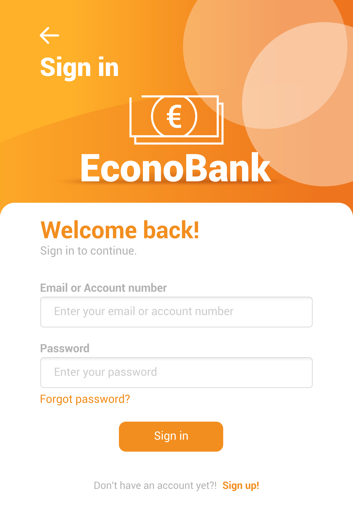
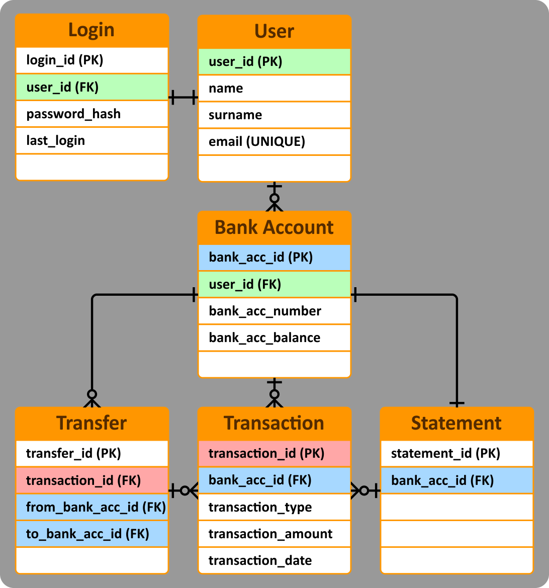

# Econo Bank App Structure

## Main Screen
- A welcome page with options to sign in or sign up.

## Sign-Up Page
- Email field(unique email validation system) and two password fields for input matching.
- Buttons to sign up, go back to Main Screen (back arrow or cancel buttons) or to Sign-In page.

## Sign-In Page
- Includes a "Forgot password" button to recover user account.
- Sign-in system.
- Buttons to go back to Main Screen (back arrow) or to Sign-Up page.
- 

## Account Overview Page
- Displays a welcome message on the account overview page with the user's name.
- Buttons for various actions:
  - Withdraw: Specify the withdrawal amount.
  - Deposit: Enter the deposit amount.
  - Transfer: Requires recipient's email and transfer amount.
  - Balance: Displays total balance and latest transactions.
  - Statement: A scrollable dialog showing all transaction history (email, amount, date).
  - Logout: Clears local user data and returns to the main screen.

## Withdraw Page
- Contains an input field for withdrawal amount.

## Deposit Page
- Includes an input field for deposit amount.

## Transfer Page
- Requires two fields: amount and recipient's email.

## Balance Page
- Shows total balance and three latest transactions.
- "More Transactions" button displays the full statement (scrollable).

## Account Information Page
- Displays user information: email, account number, name, and surname.
- Only name, surname, and password fields are editable.

# Entity Relationship Diagram (ERD)

## Login (User Authentication):
- The Login entity represents user authentication.
- Attributes: login_id, user_id, password_hash, and last_login.
- The relationship between Login and User is one-to-one:
 - Each login corresponds to a single user, and vice versa.

## User:
- The User entity contains user information.
- Attributes: user_id, name, surname, and email (unique).
- The relationship between User and Bank Account is one-to-many:
 - Each user can have multiple bank accounts.

## Bank Account:
- The Bank Account entity represents individual accounts.
- Attributes: bank_acc_id, user_id, bank_acc_number, and bank_acc_balance.
- Relationships:
 - One-to-Many with Transfer:
  - A bank account can be associated with multiple transfers (both outgoing and incoming).
 - One-to-Many with Transaction:
  - A bank account can have multiple transactions (deposits, withdrawals).
 - One-to-One with Statement:
  - A Bank Account has one statement holding it's full history.

## Transfer:
- The Transfer records only account-to-account transactions.
- Attributes: transfer_id, from_bank_acc_id, to_bank_acc_id.
- Relationships:
 - Many-to-One with Bank Account:
  - Multiple transfers can be associated with one bank account (both outgoing and incoming).
 - Many-to-One with Transaction:
  - Multiple transactions contribute to one transfer.

## Transaction:
- The Transaction entity records all financial operations.
- Attributes: transaction_id, bank_acc_id, transaction_type, transaction_amount, and transaction_date.
- the 'transaction_type' is used to know if it's a withdraw, deposit or transfer.
- Relationships:
 - Many-to-One with Bank Account:
  - Multiple transactions can be made by one Bank Account.
 - One-to-Many with transfer:
  - A single transfer event encompasses multiple individual transactions. 
 - Many-to-One with statement:
  - Multiple transactions are shown in one statement (transaction history).

## Statement:
- The Statement entity provides transaction history.
- Attributes: statement_id, and bank_acc_id.
- It’s connected to Transaction, showing how transactions form statements.
- Relationships: 
 - One-to-Many with Transaction:
  - One Statement holds many transactions (transaction history).
 - One-to-One with Bank Account:
  - One Statement can be displayed regarding one Bank Account.
